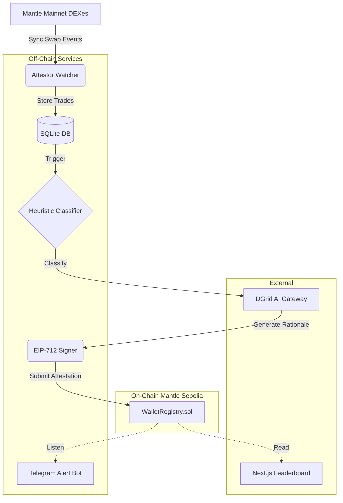

# 🔍 MantleScout — Smart Money Intelligence for Mantle Network

> AI-powered wallet classification and on-chain attestation system for Mantle Network DEXes.
Built for the **Mantle Turing Test Hackathon** (May 1 – June 16, 2026).

## 🏗 Architecture



## ✅ FCFS Deployment Criteria

| # | Criterion | Status | Proof |
|---|-----------|--------|-------|
| 1 | Smart contract on Mantle testnet | ✅ | [WalletRegistry on Mantle Sepolia](https://explorer.sepolia.mantle.xyz/address/0x5C44B0C511664bebF5EF2BD7B10DD46Ceb109Bcd) |
| 2 | Contract verified | ✅ | Verified via Sourcify |
| 3 | AI-powered function callable on-chain | ✅ | `submitLabel()` with DGrid/DeepSeek LLM rationale |
| 4 | Frontend publicly accessible | ✅ | [Link TBD after Vercel deploy] |
| 5 | Contract address in DoraHacks | ✅ | Listed in BUIDL submission |
| 6 | Demo video ≥ 2 minutes | ✅ | [Link TBD] |
| 7 | Open-source GitHub repo | ✅ | This repository |
| 8 | README with setup instructions | ✅ | You're reading it |

## 🧠 How It Works

### Wallet Classification Labels
- **Smart Trader**: Consistent high PnL across multiple tokens.
- **Patient Accumulator**: Frequent small buys without immediate sells.
- **Active LP**: Heavy engagement in liquidity pool provisioning.
- **MEV Bot**: Extreme high-frequency trading with zero holding periods.
- **Dump Prone**: Pattern of massive sells leading to high price impact.
- **Neutral**: Standard retail user with no discernable edge.

### AI Integration
- Uses DGrid AI Gateway with `deepseek/deepseek-chat` model
- Generates 1-2 sentence rationale explaining each classification
- Non-blocking: LLM failure results in empty rationale, submission still proceeds

### On-Chain Attestation
- EIP-712 signed attestations submitted to WalletRegistry contract
- Each wallet gets a label, score (0-1000), evidence hash, and attestor address
- Later attestations overwrite earlier ones (latest classification wins)

## 🚀 Quick Start

### Prerequisites
- Node.js 20+
- npm 9+
- Foundry (forge, cast)
- A Mantle Sepolia RPC URL (get one from Alchemy)

### 1. Clone & Install
```bash
git clone <repo-url>
cd smartMoneyWatcher
npm install
```

### 2. Environment Setup
```bash
cp .env.example .env
# Fill in your values:
# - RPC_URL (Alchemy Mantle Sepolia)
# - ATTESTOR_PRIVATE_KEY (from cast wallet new)
# - DGRID_API_KEY (from dgrid.ai)
# - TELEGRAM_BOT_TOKEN (from @BotFather)
# - TELEGRAM_CHAT_ID
```

### 3. Deploy Contract (if not using existing)
```bash
cd contracts
ATTESTOR_ADDRESS=<your_address> forge script script/Deploy.s.sol:DeployWalletRegistry \
  --rpc-url $RPC_URL --private-key $ATTESTOR_PRIVATE_KEY --broadcast -vvvv
```

### 4. Run Services
```bash
# Attestor (watcher + classifier + submitter)
cd services/attestor && npm run dev

# Telegram bot
cd services/telegram-bot && npm run dev

# Frontend (development)
cd apps/web && npm run dev
```

### 5. Seed Demo Data
```bash
npx tsx scripts/seed-demo.ts
```

## 📁 Project Structure
```text
 mantlescout/
 ├── contracts/
 │   ├── src/WalletRegistry.sol            [DONE]
 │   ├── test/WalletRegistry.t.sol         [DONE]
 │   ├── script/Deploy.s.sol               [DONE]
 │   └── foundry.toml                      [DONE]
 ├── services/
 │   ├── attestor/
 │   │   ├── package.json                  [DONE]
 │   │   ├── tsconfig.json                 [DONE]
 │   │   ├── src/db.ts                     [DONE]
 │   │   ├── src/watcher.ts                [DONE]
 │   │   ├── src/classifier.ts             [DONE]
 │   │   ├── src/backfill.ts               [DONE]
 │   │   ├── src/llm.ts                    [DONE]
 │   │   ├── src/submitter.ts              [DONE]
 │   │   ├── src/__tests__/classifier.test.ts [DONE]
 │   │   ├── src/__tests__/submitter.test.ts  [DONE]
 │   │   └── src/index.ts                  [DONE]
 │   └── telegram-bot/
 │       ├── package.json                  [DONE]
 │       ├── tsconfig.json                 [DONE]
 │       └── src/index.ts                  [DONE]
 ├── apps/web/                             
 │   ├── app/
 │   │   ├── globals.css                   [DONE]
 │   │   ├── layout.tsx                    [DONE]
 │   │   ├── page.tsx                      [DONE]
 │   │   └── wallet/[address]/page.tsx     [DONE]
 │   ├── lib/
 │   │   ├── abi.ts                        [DONE]
 │   │   ├── client.ts                     [DONE]
 │   │   └── constants.ts                  [DONE]
 │   ├── .env.local.example                [DONE]
 │   └── package.json                      [DONE]
 ├── scripts/
 │   └── seed-demo.ts                      [DONE]
 ├── packages/shared/
 │   ├── package.json                      [DONE]
 │   ├── tsconfig.json                     [DONE]
 │   ├── src/index.ts                      [DONE]
 │   ├── src/eip712.ts                     [DONE]
 │   └── src/abi.ts                        [DONE]
 ├── SPEC.md                               [DONE]
 ├── README.md                             [DONE]
 ├── .env.example                          [DONE]
 ├── .gitignore                            [DONE]
 └── package.json                          [DONE]
```

## 🏛 Smart Contract
- **WalletRegistry.sol**
- **Address**: `0x5C44B0C511664bebF5EF2BD7B10DD46Ceb109Bcd`
- **Network**: Mantle Sepolia (Chain ID: 5003)
- **Solidity**: ^0.8.24
- **Test Coverage**: 100% lines, 11/11 tests passing

### Key Functions
- `submitLabel(wallet, label, score, evidenceHash, signature)` — Submit a signed attestation
- `getLabel(wallet)` — Read a wallet's current attestation
- `setAttestor(address, approved)` — Owner-only attestor management

## 🔧 Tech Stack
- **Smart Contract**: Solidity ^0.8.24, Foundry
- **Backend**: TypeScript, viem, better-sqlite3, pino
- **AI**: DGrid AI Gateway (deepseek/deepseek-chat), openai SDK
- **Frontend**: Next.js 14, Tailwind CSS, viem
- **Bot**: node-telegram-bot-api, viem
- **Testing**: Foundry (forge test), Vitest

## 📊 Test Results
- **Solidity**: 11/11 tests, 100% line coverage
- **Classifier**: 9/9 heuristic tests
- **Submitter**: 3/3 pipeline tests

## 🔗 Links
- [Deployed Contract](https://explorer.sepolia.mantle.xyz/address/0x5C44B0C511664bebF5EF2BD7B10DD46Ceb109Bcd)
- Frontend — TBD after Vercel deploy
- Demo Video — TBD

## 📜 License
MIT
